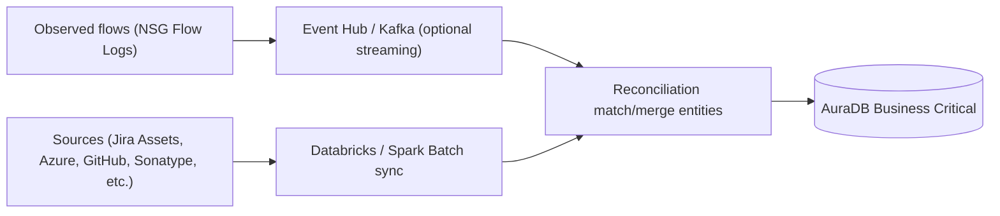
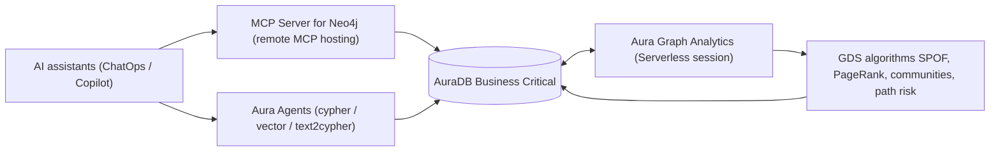

<!-- _class: lead -->


# CMDB + Network Observability

### From **Declared State** → **Observed State** on Neo4j Aura

*Architecture proposal · AuraDB Business Critical + Serverless Graph Analytics · MCP + Aura Agents*

---

## Agenda

1. **Why Observed State** — what changes when we add flows
2. **Two‑lane Aura architecture** — System of Record + Serverless Analytics
3. **Target architecture** — ingestion, reconciliation, analytics, AI
4. **Delivery phases** — A → D roadmap
5. **Implementation patterns** — flow model, reconciliation, GDS workflow
6. **References** — case study + ecosystem links

---

<!-- _class: lead -->

# Why Observed State

### Enrich the CMDB with real network behavior

---

## Today: Strong Declared State Graph

With a strong “Declared State” CMDB graph in Neo4j:

* CMDB entities and relationships modeled in a governed graph
* Declared dependencies enable fast blast‑radius exploration
* The graph provides a stable foundation to add more signals

> The next step is not replacing declared dependencies — it’s **validating and enriching** them.

---

## What Observed State Adds

By enriching declared dependencies with observed network flows (e.g., Azure NSG Flow Logs), next steps can be:

* Detect **shadow IT**
* Validate **stale / false dependencies**
* Improve **blast‑radius accuracy**
* Move toward **near‑real‑time risk posture** updates

---

<!-- _class: lead -->

# Two‑lane Aura architecture

### Persistent CMDB + Elastic analytics

---

## Lane 1: System‑of‑Record CMDB Graph

**AuraDB Business Critical** as the persistent, governed graph:

* CMDB objects + tickets + reconciliation IDs
* Constraints / indexes to harden the schema
* Provenance for multi‑source reconciliation and auditability

---

## Lane 2: Serverless Graph Analytics

**Aura Graph Analytics (serverless sessions)** for repeated analytics and write‑back:

* **Projection ↔ Write Back** workflow
* On‑demand analytics without a dedicated DS instance running full‑time
* Parallelism for multiple analysts and domains

---

<!-- _class: lead -->

# Target architecture

### Multi‑source ingestion + reconciliation + analytics loop

---

## Architecture: Ingestion & Reconciliation



---

## Architecture: Analytics & AI Loop



---

<!-- _class: lead -->

# Delivery phases

### A → D roadmap to “Observed” state

---

## Phase A — Stabilise Declared State

* Confirm canonical **entity IDs** and reconciliation approach
  *(Jira Asset objectId + cloud resource IDs + GitHub repo IDs + Sonatype component IDs)*
* Schema hardening: **uniqueness constraints** + operational indexes
* Establish domain boundaries (**11 domains today**) + ownership

---

## Phase B — Add Observed State Flow Layer

* Ingest **NSG Flow Logs** into a flow model
  `(:IP)-[:FLOW {bytes, packets, start, end, direction, action}]->(:IP)`
* Fold IP flows up to higher‑level identities:
  `Workload/Host`, `Service`, `App`, `Subnet/VLAN`, `NSG`, …
* Build **confidence scoring** over time (frequency / volume / recency)

---

## Phase C — Reconcile Declared vs Observed

<div style="display:flex; gap:2rem;">
<div>

### Diff views

* **Declared‑only** edges
  *(possibly stale)*
* **Observed‑only** edges
  *(shadow IT)*
* **Confirmed** edges
  *(both)*

</div>
<div>

### Feed back into

* Blast‑radius traversal accuracy
* Ticket enrichment
  *(incident/change correlation)*

</div>
</div>

---

## Phase D — Analytics & Operationalisation

* Run GDS for:

  * SPOF patterns, criticality ranking, dependency hotspots
  * Community detection for “interaction neighborhoods”
* **Write back** results for dashboards + alerting workflows
* Optionally expose findings via **MCP / Aura Agents**

---

<!-- _class: lead -->

# Implementation patterns

### Starter building blocks

---

## Cypher: Flow Layer Model (Observed Edges)

```cypher
MERGE (src:IP {value:$srcIp})
MERGE (dst:IP {value:$dstIp})
MERGE (src)-[f:FLOW {windowStart:$ws, windowEnd:$we}]->(dst)
SET f.bytes=coalesce(f.bytes,0)+$bytes, f.packets=coalesce(f.packets,0)+$packets,
    f.action=$action, f.direction=$direction, f.lastSeen=$lastSeen;
```

---

## Cypher: Reconcile Observed → Workload Identity

```cypher
// Link IPs to workloads via NIC/resource mapping
MATCH (ip:IP {value:$ip})
MATCH (nic:NIC {resourceId:$nicId})-[:ATTACHED_TO]->(wl:Workload)
MERGE (wl)-[:HAS_IP]->(ip);
```

---

## GDS: Projection → Compute → Write Back

```cypher
CALL gds.graph.project(
  'cmdb_observed',
  ['Workload','Service','IP','NSG'],
  {FLOW:{type:'FLOW'}, DEPENDS_ON:{type:'DEPENDS_ON'}}
);
```

---

## MCP + Aura Agents: CMDB Query & Automation

Use cases enabled by **MCP Server for Neo4j** and **Aura Agents**:

* “Ask the CMDB” in natural language → Cypher (with guardrails)
* “Explain blast radius” with evidence paths
* “Change impact briefing” including owners + recent incidents

*Note:* Security/enterprise considerations apply (e.g., constraints with IP filtering / PrivateLink for some agent-side services).

---

<!-- _class: lead -->

# References

### Case study + ecosystem context

---

## References

* CBA network observability knowledge graph
  [https://neo4j.com/blog/financial-services/network-observability-knowledge-graphs-commonwealth-bank-australia/](https://neo4j.com/blog/financial-services/network-observability-knowledge-graphs-commonwealth-bank-australia/)
* “This week in Neo4j…” (GenAI / GraphRAG ecosystem context)
  [https://neo4j.com/blog/twin4j/this-week-in-neo4j-langchain-knowledgegraph-cypher-gds-and-more/](https://neo4j.com/blog/twin4j/this-week-in-neo4j-langchain-knowledgegraph-cypher-gds-and-more/)

---

<!-- _class: lead -->

# Thank You

### Next: align on flow ingestion scope + reconciliation rules + first “declared vs observed” diff report
