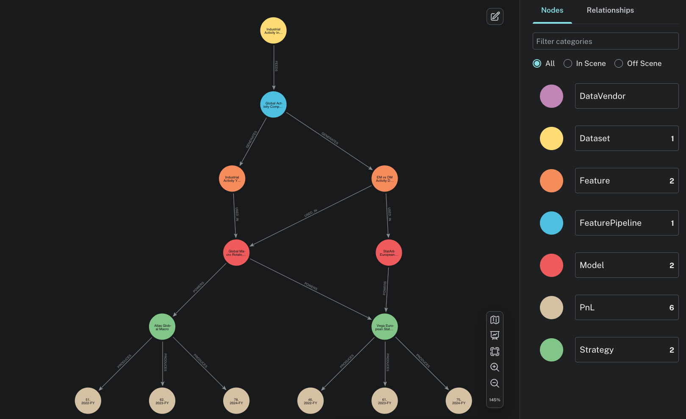
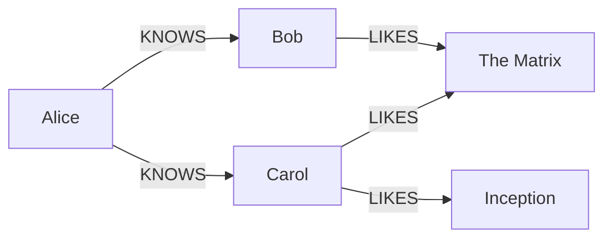
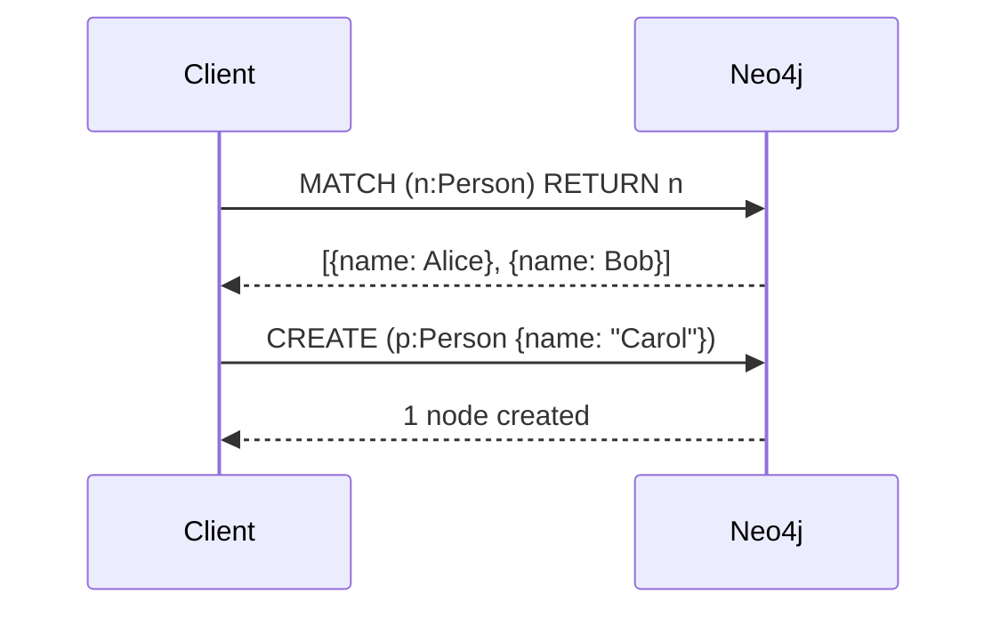

<!-- _class: lead -->


# Neo4j Template for Marp
### Unofficial Graph-native slides · Neo4j brand · Markdown-first

John Doe · john.doe@neo4j.com

---

## What's in this template?

- **Neo4j brand theme** — colors, fonts, and layout from the Needle design system
- **Cypher syntax highlighting** — auto-applied at build time
- **Mermaid diagrams** — rendered to SVG (`graph`, `sequenceDiagram`, and more)
- **KaTeX math** — inline and block equations
- **VS Code preview** — with the Marp extension

---

## Code Example

```cypher
MATCH (p:Person)-[:KNOWS]->(f:Person)
WHERE p.name = "Alice" AND f.age > 25
RETURN f.name AS friend, f.age
ORDER BY f.age DESC
LIMIT 10
```

---

<!-- _class: dense -->

## Dense Slide — Longer Code Listing

```cypher
// Find fraud rings: people sharing identity documents
MATCH (p1:Person)-[:HAS_DOC]->(doc:Document)<-[:HAS_DOC]-(p2:Person)
WHERE p1 <> p2
WITH doc, collect(DISTINCT p1) + collect(DISTINCT p2) AS suspects
WHERE size(suspects) > 2
UNWIND suspects AS s
MATCH (s)-[:MADE]->(txn:Transaction)
WHERE txn.amount > 5000
  AND txn.createdAt > datetime() - duration({days: 30})
WITH s, doc, sum(txn.amount) AS totalExposure
ORDER BY totalExposure DESC
RETURN s.name AS suspect,
       doc.number AS sharedDoc,
       totalExposure
LIMIT 20
```

---

## Two-Column Layout

<div style="display: flex; gap: 2rem;">
<div>

### Graph database
- Nodes & relationships
- Schema-optional
- Index-free adjacency

</div>
<div>

### Relational database
- Tables & foreign keys
- Fixed schema
- JOIN-based traversal

</div>
</div>

---

## Image & Quote



> "Relationships are a first-class citizen in Neo4j — not an afterthought."
> — Neo4j engineering

---

## Math — Inline & Block

Inline math: the edge weight between nodes $u$ and $v$ is $w(u,v) \in \mathbb{R}^+$.

Block (display) math — PageRank formula:

$$
PR(u) = \frac{1-d}{N} + d \sum_{v \in B_u} \frac{PR(v)}{L(v)}
$$

Shortest path cost over a graph $G=(V,E)$:

$$
\delta(s,t) = \min_{p \in P(s,t)} \sum_{(u,v) \in p} w(u,v)
$$

```markdown
Inline:  $E = mc^2$
Block:   $$\sum_{i=1}^{n} x_i$$
```

---

## Mermaid — Graph diagram



---

## Mermaid — Sequence diagram



---

## Media — Inline image

Resize with `width` or `height`:


```markdown


```

---

## Media — Background split (left)


The image fills the **left 40%** of the slide.
Right side is normal content.

```markdown

```

---

## Media — Background split (right)


The image fills the **right 40%** of the slide.
Content flows on the left.

```markdown

```

---

## Media — Full background

<!-- _class: invert -->


```markdown
   ← fills entire slide
 ← fits without cropping
     ← explicit scale
```

---

<!-- _class: invert -->

## Invert — Table Example

| Feature | Neo4j | RDBMS |
|---|---|---|
| Data model | Property graph | Tables & foreign keys |
| Relationships | First-class, typed | JOIN at query time |
| Schema | Optional, flexible | Required, rigid |
| Query language | Cypher | SQL |
| Best for | Connected data | Tabular / aggregate |

**Rule of thumb:** if your queries are mostly traversals, reach for a graph.

---

<!-- _class: lead -->

# Start building
### Replace `slides.md` with your content and run `npm run pdf`

**neo4j.com** · Community template · Not official Neo4j material
