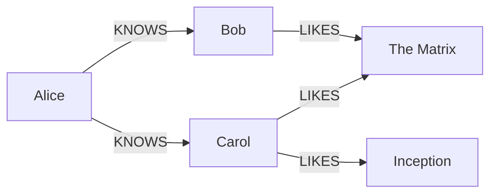
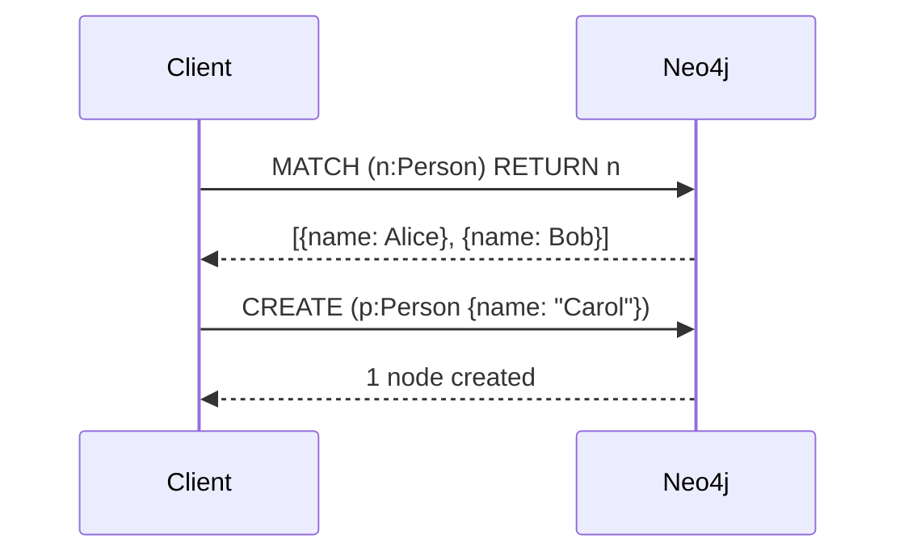
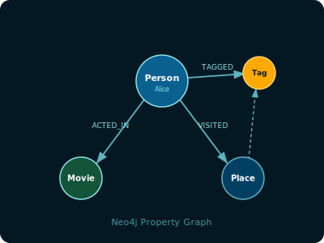

<!-- _class: lead -->

# Welcome to Marp
### Create beautiful slide decks with Markdown

---

## What is Marp?

- Write slides in **Markdown**
- Export to **PDF**, **HTML**, or **PPTX**
- Use **themes** and custom **CSS**
- Integrates with **VS Code**

---

## Code Example

```cypher
MATCH (p:Person)-[:KNOWS]->(f:Person)
WHERE p.name = "Alice" AND f.age > 25
RETURN f.name AS friend, f.age
ORDER BY f.age DESC
LIMIT 10
```

---

## Two-Column Layout

<div style="display: flex; gap: 2rem;">
<div>

### Left Column
- Point one
- Point two
- Point three

</div>
<div>

### Right Column
- Alpha
- Beta
- Gamma

</div>
</div>

---

## Image & Quote

> "Simplicity is the ultimate sophistication."
> — Leonardo da Vinci

---

## Math — Inline & Block

Inline math: the edge weight between nodes $u$ and $v$ is $w(u,v) \in \mathbb{R}^+$.

Block (display) math — PageRank formula:

$$
PR(u) = \frac{1-d}{N} + d \sum_{v \in B_u} \frac{PR(v)}{L(v)}
$$

Shortest path cost over a graph $G=(V,E)$:

$$
\delta(s,t) = \min_{p \in P(s,t)} \sum_{(u,v) \in p} w(u,v)
$$

```markdown
Inline:  $E = mc^2$
Block:   $$\sum_{i=1}^{n} x_i$$
```

---

## Mermaid — Graph diagram



---

## Mermaid — Sequence diagram



---

## Media — Inline image

Resize with `width` or `height`:



```markdown


```

---

## Media — Background split (left)


The image fills the **left 40%** of the slide.
Right side is normal content.

```markdown

```

---

## Media — Background split (right)


The image fills the **right 40%** of the slide.
Content flows on the left.

```markdown

```

---

## Media — Full background

<!-- _class: invert -->


```markdown
   ← fills entire slide
 ← fits without cropping
     ← explicit scale
```

---

<!-- _class: lead -->

# Thank You!

Export with: `npm run pdf`
